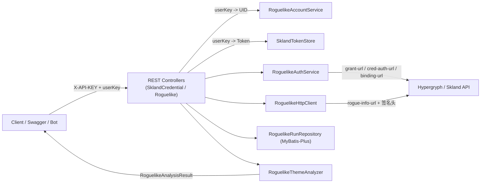

# 后端调用 Flow 说明

> 目标：向接入同学清晰描述森空岛 Token 绑定、肉鸽数据刷新与分析的端到端链路，并解释核心配置项的归属。

## 1. 核心角色

| 角色 | 说明 |
| --- | --- |
| 调用方（Bot/Swagger/脚本） | 负责携带 `X-API-KEY`、`X-SKLAND-TOKEN` 与自定义 `userKey` 调用接口。 |
| `SklandCredentialController` | 绑定/更新森空岛 Token 与业务 `userKey`、UID 的入口。 |
| `RoguelikeController` | 提供主题列表、手动刷新与分析查询的 REST 接口。 |
| `RoguelikeAccountService` | 维护 `userKey -> UID` 的映射，可切换到持久化实现。 |
| `SklandTokenStore` | 保存 `userKey -> 森空岛 Token`（当前为内存存储）。 |
| `RoguelikeAuthService` | 使用森空岛官方接口完成 oauth_code → cred/token → uid 的认证链。 |
| `RoguelikeHttpClient` | 对接 Hypergryph/森空岛所有 HTTP 请求与签名。 |
| `RoguelikeRunRepository` | 使用 MyBatis-Plus 写入/读取肉鸽关卡历史数据。 |
| `RoguelikeThemeAnalyzer` | 针对不同主题生成业务分析结果。 |

## 2. 流程拆解

### 2.1 绑定森空岛 Token（一次性/按需更新）
1. 调用方选定一个 `userKey`（例如 QQ 号或业务 ID），并在 Header 中携带 `X-API-KEY`（配置项 `roguelike.api-key`）。  
2. 调用 `POST /api/skland/credentials/{userKey}`，额外在 Header 带上 `X-SKLAND-TOKEN=<森空岛 Token>`，Body 可选提供 `uid`。  
3. 控制器验证 Header → 将 `X-SKLAND-TOKEN` 写入 `SklandTokenStore`，若 body 中包含 `uid`，则写入 `RoguelikeAccountService`。  
4. 绑定完成后，同一个 `userKey` 就可以在后续刷新/查询接口中复用，无需把 token 存在 `.env`。

### 2.2 刷新并分析肉鸽数据
1. 调用 `POST /api/roguelike/{userKey}/refresh`（可选 `themeId`），Header 同样带 `X-API-KEY`。  
2. 控制器从 `RoguelikeAccountService` 解析 `userKey` 对应 UID；从 `SklandTokenStore` 取出森空岛 Token。  
3. `RoguelikeAuthService` 使用该 Token 依次访问：
   - `hypergryph.endpoint.grant-url` → 获取 `oauth_code`；
   - `hypergryph.endpoint.cred-auth-url` → 换取 `cred` 与 `token`；
   - `hypergryph.endpoint.binding-url` → 校验账号，并得到森空岛返回的 UID。
4. 拿到 `cred/token/uid` 后，`RoguelikeHttpClient` 再调用 `hypergryph.endpoint.rogue-info-url` 拉取肉鸽主题及历史记录。  
5. `RoguelikeRunRepository` 将历史记录落入数据库（dev: H2 内存；prod: MySQL）。  
6. `RoguelikeThemeAnalyzer` 读取刚写入的历史数据生成 `RoguelikeAnalysisResult`，同时写入 5 分钟缓存，返回给调用方。

### 2.3 查询缓存/历史分析
- `GET /api/roguelike/{userKey}/{themeId}/analysis?refresh=false` 时不再触发外部请求：  
  1. 验证 API Key → 根据 `userKey` 获取 UID；  
  2. 命中 5 分钟缓存则直接返回，否则从数据库回放历史记录让对应主题 Analyzer 计算；  
  3. 若历史为空，则返回 404 提示需先刷新。

## 3. Flow 可视化

## 4. 关键配置与请求值

| 名称 | 层级/文件 | 用途 | 设置方式 |
| --- | --- | --- | --- |
| `roguelike.api-key` | `application.yml` → `roguelike.api-key` | 保护所有后台开放接口，要求调用方在 Header 中携带同值 `X-API-KEY`。 | 开发阶段可直接写 `local-dev-key`；生产建议改为安全值并只通过运维渠道发放。 |
| `userKey` | URL Path 参数 | 业务侧对账号的唯一标识（例如 QQ、手机号、Guild ID），后端据此读取 token、UID。 | 由调用方自由定义；确保后续刷新/查询使用同一个值。 |
| `X-SKLAND-TOKEN` | `POST /api/skland/credentials/{userKey}` Header | 森空岛（Skland）返回的授权 token，只用于 Hypergryph OAuth 链。 | 通过官方 APP 或脚本获取，直接放在 Header 中提交并绑定。 |
| `uid`（可选） | 绑定接口 Body | 如果调用方已经知道明日方舟 UID，可提前写入以与 Hypergryph 返回值保持一致。 | 可留空，系统会在绑定链中自动解析。 |
| 数据源配置 | `spring.profiles.dev/mysql` | 控制落库行为，dev 为 H2 自动建表，mysql 关闭自动初始化。 | 本地调试默认 `dev`；部署时切换 `mysql`，并按 `database/ddl` 执行迁移。 |

## 5. 调试指引
1. **绑定 Token**：`POST /api/skland/credentials/{userKey}`，Header `X-API-KEY` + `X-SKLAND-TOKEN`（Body 可选 `{"uid":"optional"}`）。  
2. **列出主题**：`GET /api/roguelike/themes` 验证鉴权是否通过。  
3. **首次刷新**：`POST /api/roguelike/{userKey}/refresh?themeId=rogue_4`。  
4. **查询分析**：`GET /api/roguelike/{userKey}/{themeId}/analysis`（可在 Swagger/Knife4j 中直接操作，Authorize 区填写 `X-API-KEY` 即可自动附带）。  

如需排查值传递问题，可在调用前后对照上述 Flow 与配置表逐项核验。该文档更新时请同步链接到 `integration-stage7.md` 与顶层 README。 
